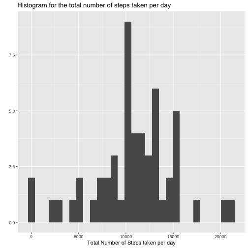
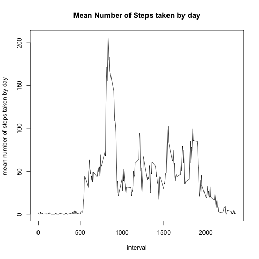
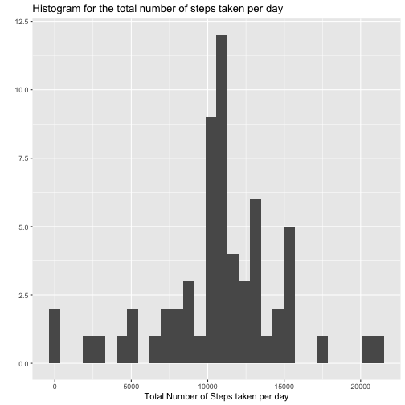
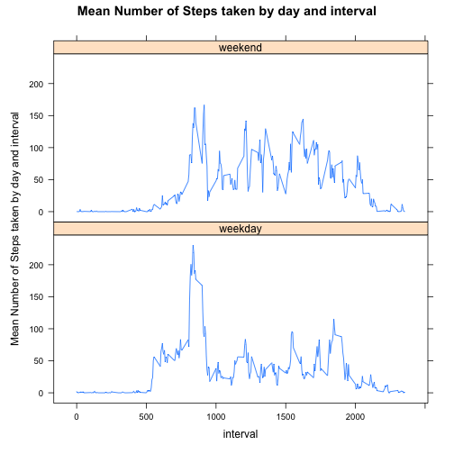

## Loading and preprocessing the data
The following code process and transform the data (if necessary) into a format suitable for the analysis.


```r
data = read.csv("./activity.csv")
# date recognized as such
library(lubridate)
data$pretty_date = ymd(data$date)
```

## What is mean total number of steps taken per day?

The following code :

* calculates the total number of steps taken per day
* makes a histogram of the total number of steps taken each day
* calculates and reports the mean and median of the total number of steps taken per day


```r
library('dplyr')
# Total Number of Steps taken per day
total_number_of_steps_taken_by_day = data %>% group_by(pretty_date) %>% summarise(total_number_of_steps_taken_by_day=sum(steps))

# Plot the total Number of Steps taken per day
library('ggplot2')
with(total_number_of_steps_taken_by_day, qplot(total_number_of_steps_taken_by_day, xlab = 'Total Number of Steps taken per day', main = 'Histogram for the total number of steps taken per day'))
```

```
## `stat_bin()` using `bins = 30`. Pick better value with `binwidth`.
```

```
## Warning: Removed 8 rows containing non-finite values (`stat_bin()`).
```



```r
# Calculate Mean and Median
mean_total_number_of_steps_taken_by_day = mean(total_number_of_steps_taken_by_day$total_number_of_steps_taken_by_day, na.rm = TRUE)
sprintf("%s : %f", "Mean of the total number of steps taken by day", mean_total_number_of_steps_taken_by_day)
```

```
## [1] "Mean of the total number of steps taken by day : 10766.188679"
```

```r
median_total_number_of_steps_taken_by_day = median(total_number_of_steps_taken_by_day$total_number_of_steps_taken_by_day, na.rm = TRUE)
sprintf("%s : %f", "Median of the total number of steps taken by day", median_total_number_of_steps_taken_by_day)
```

```
## [1] "Median of the total number of steps taken by day : 10765.000000"
```

## What is the average daily activity pattern?
The following code makes a time series plot (i.e. type = "l") of the 5-minute interval (x-axis) and the average number of steps taken, averaged across all days (y-axis).


```r
mean_number_of_steps_taken_by_interval = data %>% filter(!is.na(steps)) %>% group_by(interval) %>% summarise(mean_number_of_steps_taken_by_day=mean(steps))
# Plot the mean Number of Steps taken per day
plot(x=mean_number_of_steps_taken_by_interval$interval, y=mean_number_of_steps_taken_by_interval$mean_number_of_steps_taken_by_day, xlab=("interval"), ylab = "mean number of steps taken by day", main = "Mean Number of Steps taken by day", type="l")
```



```r
# Get which 5-minute interval, on average across all the days in the dataset, contains the maximum number of steps
index_max = which.max(mean_number_of_steps_taken_by_interval$mean_number_of_steps_taken_by_day)
max_val = mean_number_of_steps_taken_by_interval[index_max,]$mean_number_of_steps_taken_by_day
sprintf("%d : %s", index_max, " is the 5-minute interval which, on average across all the days in the dataset, contains the maximum number of steps")
```

```
## [1] "104 :  is the 5-minute interval which, on average across all the days in the dataset, contains the maximum number of steps"
```

## Imputing missing values

The following code :

* calculates and reports the total number of missing values in the dataset (i.e. the total number of rows with NAs)
* uses the mean for that 5-minute interval to fill the missing values
* creates a new dataset that is equal to the original dataset but with the missing data filled in
* makes a histogram of the total number of steps taken each day
* calculate and reports the mean and median for the total number of steps taken per day


```r
#   Do these values differ from the estimates from the first part of the assignment? 
#   What is the impact of imputing missing data on the estimates of the total daily number of steps?
#      It created new data with value = mean
#      As a result, it had no impact on mean values but changed the distribution of data. It had an effect on the median.

number_of_row_with_na = sum(is.na(data$steps))
sprintf("%d : %s", number_of_row_with_na, " is the the total number of missing values in the dataset")
```

```
## [1] "2304 :  is the the total number of missing values in the dataset"
```

```r
sprintf("There are no NA in columns apart from the steps column in the dataset")
```

```
## [1] "There are no NA in columns apart from the steps column in the dataset"
```

```r
# NA steps is filled with the mean for this interval across all days
data_with_average = full_join(data, mean_number_of_steps_taken_by_interval, by="interval")
data_with_average$steps_wo_na = ifelse(is.na(data_with_average$steps), data_with_average$mean_number_of_steps_taken_by_day, data_with_average$steps)

data_wo_na = data_with_average %>% select(steps_wo_na, pretty_date, interval) %>% rename(steps = steps_wo_na, date=pretty_date)
total_number_of_steps_taken_by_day_wo_na = data_wo_na %>% group_by(date) %>% summarise(total_number_of_steps_taken_by_day=sum(steps))

# Plot the total Number of Steps taken per day
with(total_number_of_steps_taken_by_day_wo_na, qplot(total_number_of_steps_taken_by_day, xlab = 'Total Number of Steps taken per day', main = 'Histogram for the total number of steps taken per day'))
```

```
## `stat_bin()` using `bins = 30`. Pick better value with `binwidth`.
```



```r
# Calculate Mean and Median
mean_total_number_of_steps_taken_by_day_wo_na = mean(total_number_of_steps_taken_by_day_wo_na$total_number_of_steps_taken_by_day, na.rm = TRUE)
sprintf("%s : %f", "The mean for the total number of steps taken per day is ", mean_total_number_of_steps_taken_by_day_wo_na)
```

```
## [1] "The mean for the total number of steps taken per day is  : 10766.188679"
```

```r
median_total_number_of_steps_taken_by_day_wo_na = median(total_number_of_steps_taken_by_day_wo_na$total_number_of_steps_taken_by_day, na.rm = TRUE)
sprintf("%s : %f", "The median for the total number of steps taken per day is ", median_total_number_of_steps_taken_by_day_wo_na)
```

```
## [1] "The median for the total number of steps taken per day is  : 10766.188679"
```

The mean does not differ from the estimate from the first part of the assignment quite logically since we imputed with the mean.
However, the median differs from the estimate from the first part of the assignment.
This phenomenon should not come as a surprise since the imputation of values had an effect on the distribution of step values and therefore on the median.

## Are there differences in activity patterns between weekdays and weekends?

The following code :

* creates a new factor variable in the dataset with two levels – “weekday” and “weekend” indicating whether a given date is a weekday or weekend day.
* makes a panel plot containing a time series plot (i.e. type = "l") of the 5-minute interval (x-axis) and the average number of steps taken, averaged across all weekday days or weekend days (y-axis).


```r
# Creation of the factor variable
data_wo_na$is_weekend = (wday(data_wo_na$date) == 1) | (wday(data_wo_na$date) == 7)
data_wo_na$day_of_week = wday(data_wo_na$date, abbr = FALSE, label = TRUE)
data_wo_na$weekpart = as.factor(ifelse(data_wo_na$is_weekend, "weekend", "weekday"))

# Plot for question 2
mean_number_of_steps_taken_by_interval_weekpart = data_wo_na %>% summarise(mean_number_of_steps_taken_by_day=mean(steps), .by=c(interval, weekpart))

library(lattice)
xyplot(mean_number_of_steps_taken_by_day ~ interval | weekpart, mean_number_of_steps_taken_by_interval_weekpart, scales = list(relation = "same", alternating = FALSE), ylab = "Mean Number of Steps taken by day and interval", main = "Mean Number of Steps taken by day and interval", type="l",layout = c(1,2))
```



The plot depicts a significant difference between activities on weekend and weekday.
